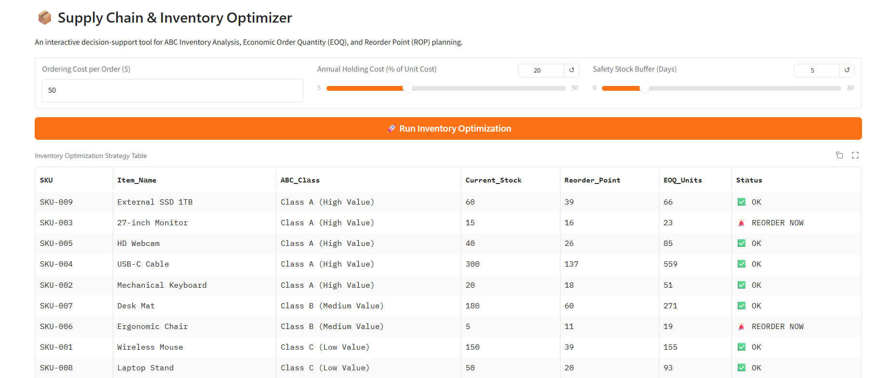
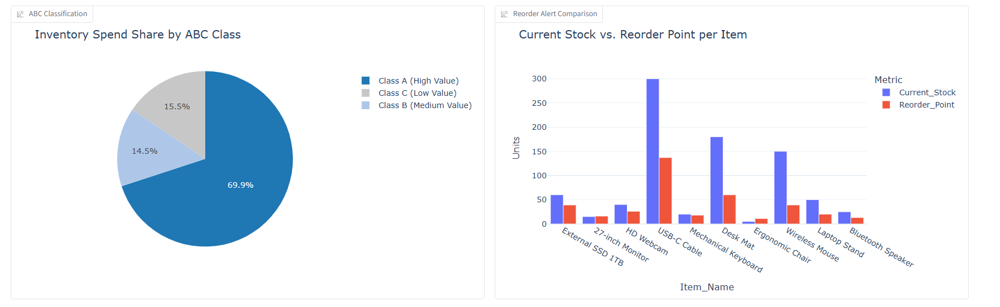
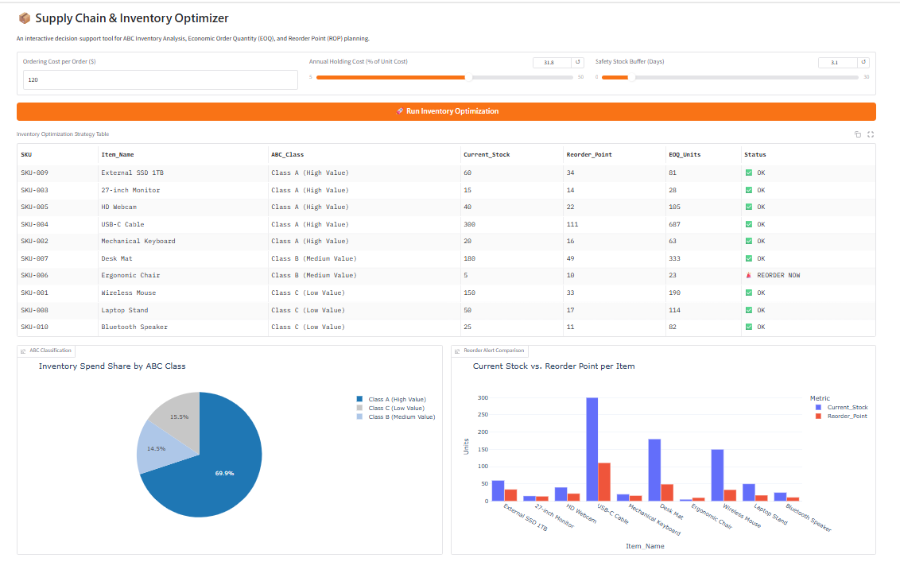

# 📦 Inventory & Supply Chain Optimization App

An interactive decision-support application built with **Python**, **Gradio**, and **Plotly** to streamline inventory management using **ABC Pareto Classification**, **Economic Order Quantity (EOQ)**, and **Reorder Point (ROP)** planning.

## Dashboard Preview

<p align="center">
  
</p>

<p align="center">
  
</p>

<p align="center">
  
</p>

---

## 🔑 Key Features
- **ABC Inventory Analysis:** Dynamically categorizes SKUs into Class A (70% value), Class B (20%), and Class C (10%) based on cumulative annual spend.
- **Economic Order Quantity (EOQ):** Calculates optimal batch sizes to minimize combined ordering and holding costs.
- **Reorder Point (ROP) Alerts:** Computes dynamic safety stock levels based on lead times and flags immediate reorder alerts (`🚨 REORDER NOW`).
- **Interactive Controls:** Adjustable parameters for unit ordering cost, holding cost percentage, and safety stock buffer days.

---

## 📊 Analytical Methodology & Formulas
1. **Annual Spend:** $\text{Demand} \times \text{Unit Cost}$
2. **Economic Order Quantity (EOQ):**
   $$\text{EOQ} = \sqrt{\frac{2 \times \text{Annual Demand} \times \text{Ordering Cost}}{\text{Holding Cost per Unit}}}$$
   
4. **Reorder Point (ROP):**
   $$\text{ROP} = (\text{Daily Demand} \times \text{Lead Time Days}) + \text{Safety Stock}$$

---

## 🛠️ Installation & Local Setup

## 🛠️ Installation & Local Setup

1. **Clone the repository:**
   ```bash
   git clone https://github.com/Hassan-Farahat/Inventory-Supply-Chain-Optimization-App.git
   cd Inventory-Supply-Chain-Optimization-App
